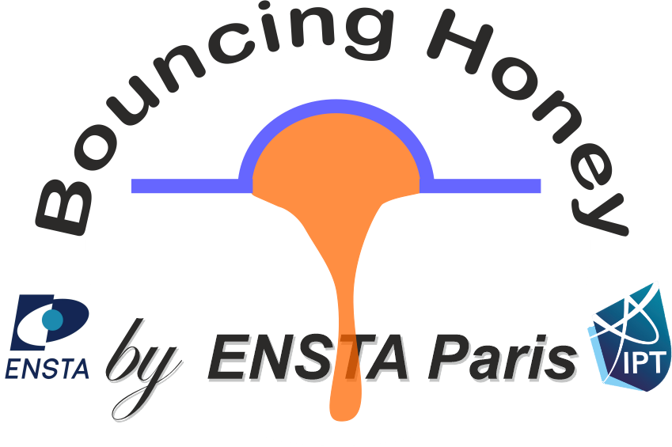
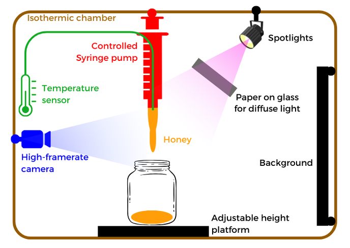
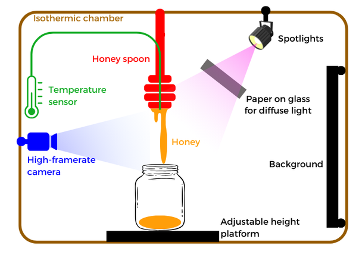
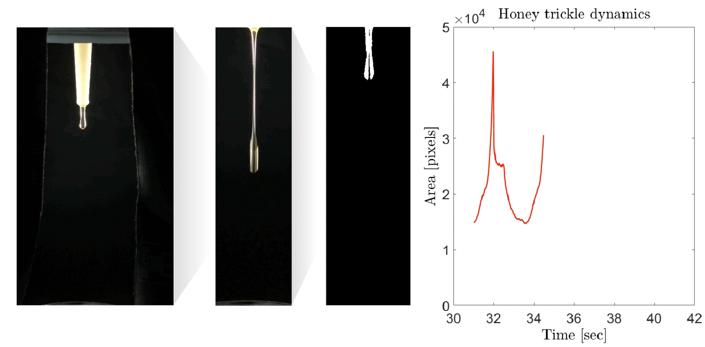
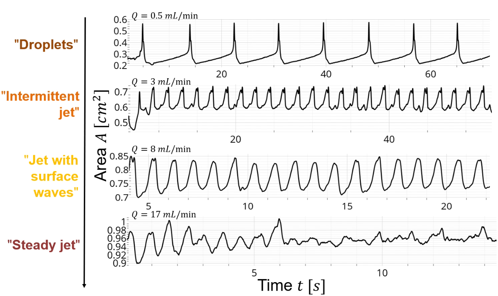
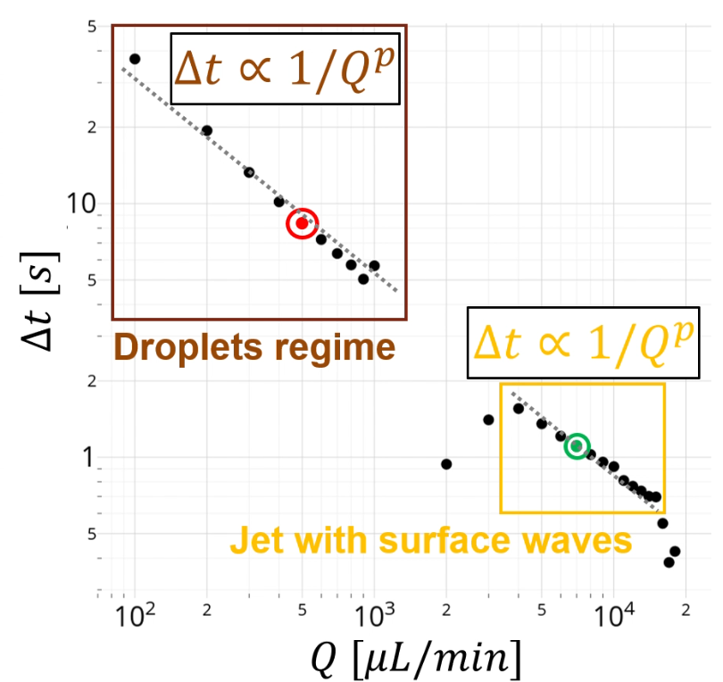
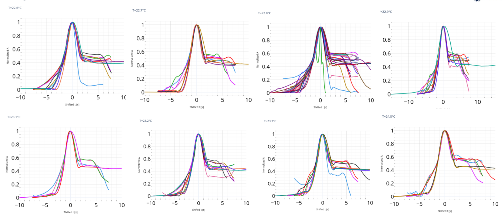
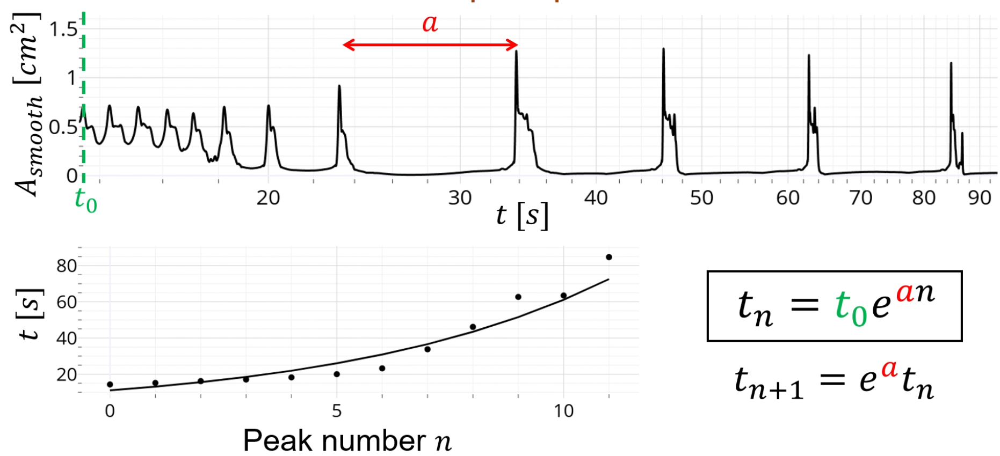

    
    <h1>Bouncing Honey by ENSTA Paris</h1>
    <h3>Repository containing the code to analyse experiments from the project</h3>
    <a href="https://perso.ensta.fr/~ipt">Homepage</a> - Trailer (coming soon) - Full video (coming soon)

- [🚀 How to use this project](#-how-to-use-this-project)
  - [Step 1 - Analyse experimental footage](#step-1---analyse-experimental-footage)
  - [Step 2 - Plot curves and calculate regressions](#step-2---plot-curves-and-calculate-regressions)
    - [Flow analysis](#flow-analysis)
    - [Unalimented + Temperature analysis](#unalimented--temperature-analysis)
- [🖼️ Sample results](#-sample-results)
- [📜 Credits](#-credits)
- [🔐 License](#-license)

# 🚀 How to use this project

## Step 1 - Analyse experimental footage

This step uses the [MATLAB program](./1-video-treatment) to extract relevant data from video footage of experiments.

The experimental setup uses a camera in front of honey dripping from whether a syringe pump - to control the flow rate - or a proper honey spoon. Light is adjusted so that the **trickle is shinning white in front of a black background**. This step is important to ensure a proper extraction by the MATLAB program.

> The experimental setup using a controlled syringe pump

> The experimental setup using a honey spoon

The videos should next be analyzed by the MATLAB program by processing as follows:

- Take a picture with the camera at the same location as during the experiment, but without any honey ; this will serve as a "reference" image, that will be subtracted to the videos to better extract proper honey
- Place every video in a folder at the root of the [`1-video-treatment` folder](./1-video-treatment)
- Adjust all parameters in the [main script](./1-video-treatment/main.m)
- Run the [main script](./1-video-treatment/main.m) (this can take a long time depending on the duration and the quality of videos)

Honey data is the extracted using a threshold and a biggest connected component extraction.

> Preview of the numerical treatment pipeline achieved by the MATLAB program

**Important note for the analysis:** some static data tied to the videos still need to be precised after the program has treated the videos. They are stored in the same results folder, and their filename simply corresponds to the filename of the original video, without any date. Further information can be found in the next part regarding the information to fill in these files.

## Step 2 - Plot curves and calculate regressions

Now that all data is extracted, we can analyze it and create plots using [Jupyter Notebooks](./2-numerical-analysis). Two are available:

- The [flow analysis](./2-numerical-analysis/flow_analysis.ipynb), when using the **controlled syringe pump** setup
- The [unalimented analysis](./2-numerical-analysis/unalimented_temperature_analysis.ipynb), when using the **spoon** setup
  - This also analyses the influence of honey temperature on relevant data

### Flow analysis

- Before continuing, you should complete the `rate` field (flow rate, in µL/min) of the info file for each video
- Optionally, you can set a custom starting for each video using the `beginning` field (in seconds)

[Go to the notebook](./2-numerical-analysis/flow_analysis.ipynb)

### Unalimented + Temperature analysis

- Before continuing, you should complete the `temperature` field (in °C) of the info file for each video
- You can also define the beginning of the oscillations phase (in seconds), detected empirically by watching the videos
- Optionally, you can set a custom starting for each video using the `beginning` field (in seconds)

[Go to the notebook](./2-numerical-analysis/unalimented_temperature_analysis.ipynb)

# 🖼️ Sample results

> An outline of the different honey flow regimes that appear, when varying the flow rate of the syringe pump

> Oscillations period as a function of the flow rate

> Looking for the self-similarity of honey drops over time, using a min-max y normalization and a x normalization at A=0.6

> When honey is no longer alimented, times at which a droplet detaches grow exponentially

# 📜 Credits

- Main contributor: Théo Vidal
- Supervisors: Romain Monchaux, Jérôme Perez
- Thanks to Fabien Saladini for the help with the MATLAB code!

# 🔐 License

[GNU GPL v3](./LICENSE)
